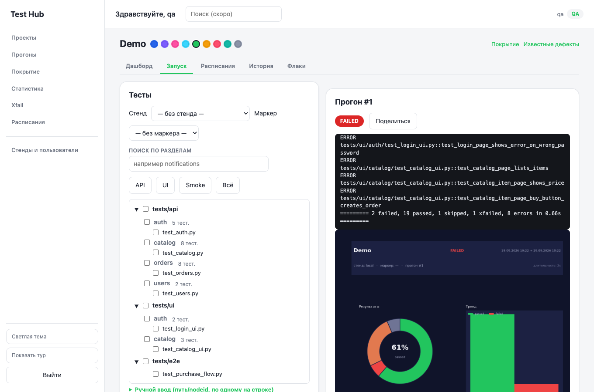
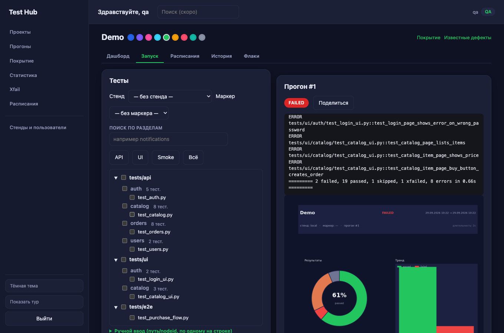
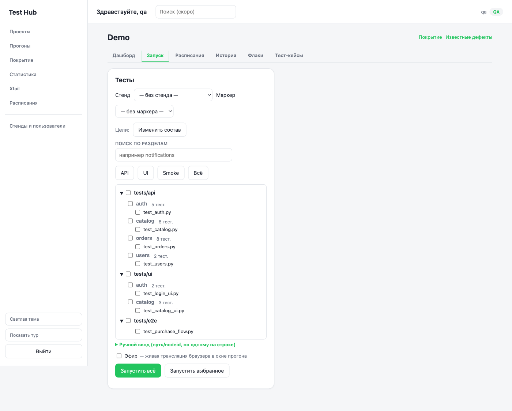
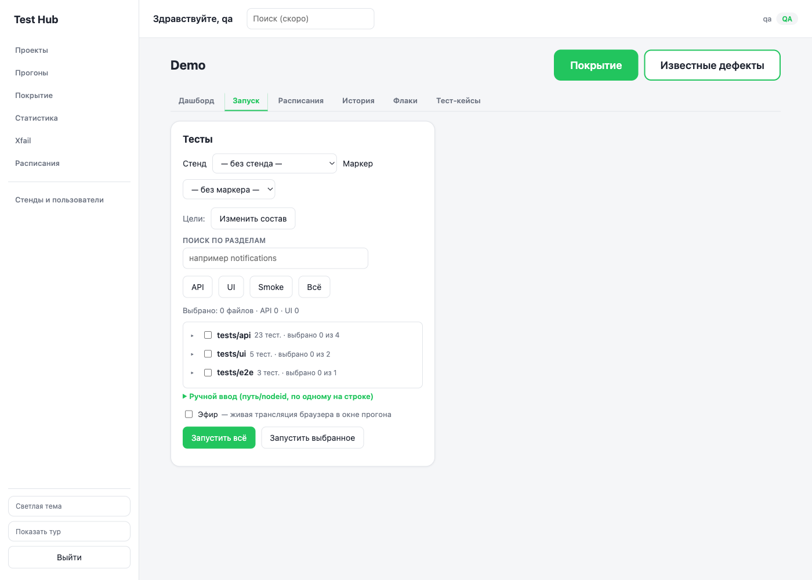
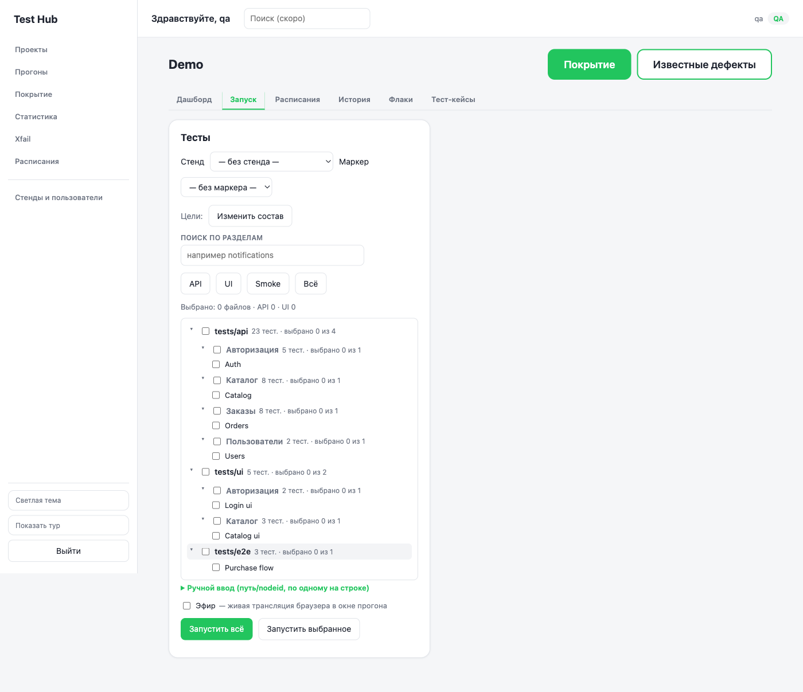
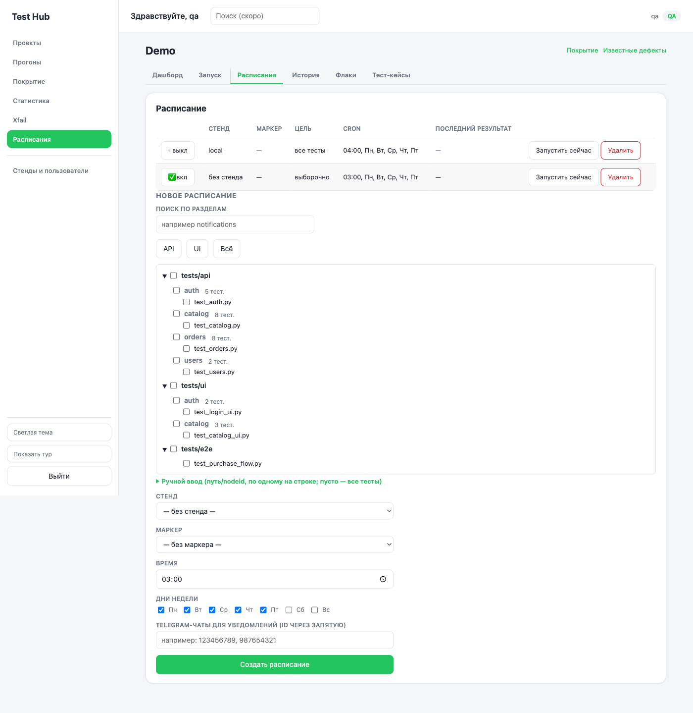
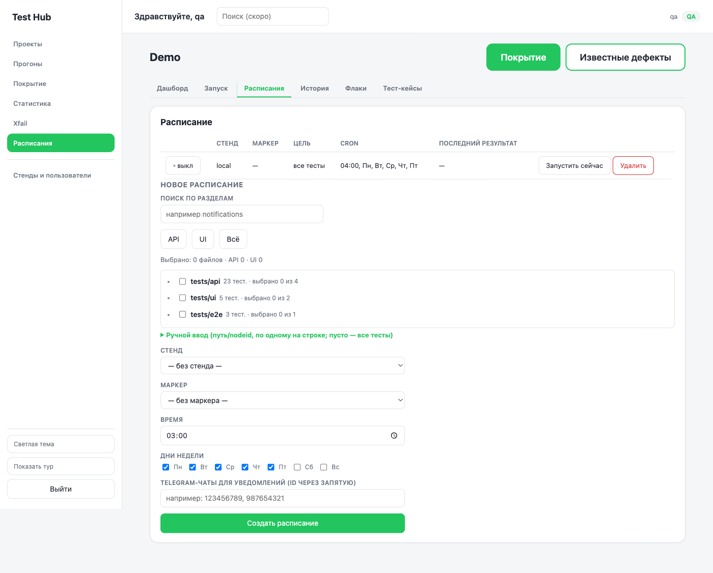

# test_hub — система запуска автотестов с ролями

Отдельный продукт (не cyber_office): веб-система, где QA хранит и записывает тесты,
менеджеры и заказчики запускают прогоны и смотрят отчёты в реальном времени.

## Установка и запуск

Зависимости уже поставлены в `.venv` (см. `requirements.txt`: FastAPI, uvicorn,
pytest, allure-pytest, playwright, matplotlib).

1. Скопируйте `.env.example` в `.env` и при необходимости поменяйте значения:
   ```bash
   cp .env.example .env
   ```
   - `TH_PORT` — порт сервера (по умолчанию `8700`).
   - `TH_SECRET` — секрет для подписи сессионных cookie (замените значение по
     умолчанию `change-me` перед реальным использованием).
   - `TH_PUBLIC_URL` — базовый URL, по которому test_hub виден снаружи (по
     умолчанию `http://127.0.0.1:8700`); используется только для публичных
     ссылок на отчёты, см. «Публичная ссылка на отчёт».
   - `TH_DEMO` — включён ли встроенный демо-сервис для проекта `Demo` (по
     умолчанию `1`); `0` — не поднимать демо-сервис (сам проект `Demo` при этом
     всё равно засеивается, но его стенд окажется недоступен). См. «Быстрый
     старт с демо» ниже.
   - `TH_DEMO_PORT` — порт демо-сервиса (по умолчанию `8710`), отдельный от `TH_PORT`.

   Без `.env` сервер запускается с этими же значениями по умолчанию (`app/config.py`).

2. Запуск сервера:
   ```bash
   .venv/bin/python -m app.main
   ```
   Поднимается на `http://127.0.0.1:<TH_PORT>` (по умолчанию 8700). При старте
   создаётся/инициализируется `workspace/test_hub.db` и, если она пустая,
   засеивается пользователями и проектами (см. «Роли и логины» и «Тестовые проекты
   для разработки» ниже).

3. Запуск тестов:
   ```bash
   .venv/bin/python -m pytest -q
   ```

Это локальный запуск для разработки. Для развёртывания на сервере (Docker или
systemd, перенос `workspace/`, подключение проектов тестов, обновление,
откат) — см. [docs/DEPLOY.md](docs/DEPLOY.md).

## Быстрый старт с демо

От клона до первого прогона с отчётом — без доступа к боевым стендам, только
на встроенном демо-проекте:

```bash
git clone <URL репозитория test_hub>
cd test_hub
# зависимости уже в .venv, см. «Установка и запуск» выше
.venv/bin/python -m app.main
```

На пустой БД (первый запуск, `workspace/test_hub.db` ещё не существует) сервер
сам засеивает проект `Demo` (`demo/` внутри репозитория — маленький
FastAPI-магазин с намеренным багом в расчёте скидки, для наглядности) со
стендом `local` и поднимает для него встроенный демо-сервис — отдельным
подпроцессом на порту из `TH_DEMO_PORT` (по умолчанию `8710`, переменная
`TH_DEMO` включает/выключает сам сервис, см. выше).

Дальше:

1. Откройте `http://127.0.0.1:8700` (или свой `TH_PORT`) и войдите под любой
   из seed-учёток (например `qa`/`qa`, см. «Роли и логины» ниже).
2. На странице «Проекты» откройте карточку `Demo`.
3. На вкладке «Запуск» нажмите «Запустить всё» (`#run-all-btn`) — запустится
   полный прогон демо-тестов (`demo/tests/`) на стенде `local`.
4. Дождитесь завершения в «Ленте прогонов» и нажмите «Отчёт» — откроется
   отчёт прогона (счётчики, PNG-график, список тестов с сообщениями об
   ошибках). Часть демо-тестов **ожидаемо падает** (баг скидки в
   `demo/app/routers/orders.py`, специально оставлен как пример). Полный
   статический Allure-отчёт того же прогона можно получить кнопкой
   «Поделиться» (роль `qa`/`manager`, см. «Публичная ссылка на отчёт» ниже) —
   если на сервере доступен `allure` CLI, ссылка откроет его.

## Роли и логины

Seed-пользователи (создаются автоматически при первом запуске на пустой БД):

| Логин | Пароль | Роль |
|---|---|---|
| `qa` | `qa` | qa |
| `manager` | `manager` | manager |
| `customer` | `customer` | customer |
| `admin` | `admin` | superadmin |

Что может каждая роль по факту реализованных прав доступа:

| Роль | Может |
|---|---|
| **qa** | всё: CRUD проектов и стендов, CRUD пользователей, просмотр дерева тестов, запуск/просмотр/отмена прогонов и отчётов |
| **manager** | просмотр проектов, стендов и дерева тестов; запуск прогонов, просмотр истории и отчётов, **отмена прогонов**; онбординг при первом входе (seed-пользователь `manager` создаётся с `onboarded=false`) |
| **customer** | просмотр проектов, стендов и дерева тестов; запуск прогонов, просмотр истории и отчётов; **без отмены прогонов** и без доступа к управлению проектами/пользователями |
| **superadmin** | всё, что может `qa`, плюс страница «Суперадминка» — полный доступ на чтение/запись/удаление ко всем таблицам БД (см. раздел «Суперадминка» ниже) |

Управление пользователями (`/api/users*`) и проектами/стендами (`/api/projects*`
на запись) доступно ролям `qa` и `superadmin`. На странице «Проекты» обе роли видят
кнопку «+ Добавить проект» и могут создать проект прямо из интерфейса, указав путь
к репозиторию на диске (должен существовать) и venv.

Пока у пользователя `onboarded=false`, при входе автоматически запускается
пошаговый тур (`ui/tour.js`) по основным разделам интерфейса: Проекты →
карточка проекта `Demo` → вкладки страницы проекта → запуск раздела тестов →
лента прогонов и отчёт Allure → «Покрытие» → «Известные дефекты» →
«Суперадминка» (последний шаг виден только роли `superadmin`, для остальных
ролей пропускается). Каждый шаг — подсветка нужного элемента и подсказка;
кнопка «Пропустить» завершает тур досрочно. Из seed-учёток выше он сам
запустится только под `manager` (единственная сидится с `onboarded=false`, см.
таблицу выше) — но повторно запустить тур под любой ролью можно в любой
момент кнопкой «Показать тур» в подвале сайдбара, она сбрасывает прогресс тура
без обращения к `onboarded`.

## Суперадминка

Роль `superadmin` (seed-логин `admin` / пароль `admin`, см. таблицу выше) видит в
шапке дополнительный пункт меню «Суперадминка» (`ui/admin_all.html`) — единственное
место в системе с доступом ко всем данным БД без ограничений по проекту/роли:

- обзор — счётчики по всем таблицам (`users`, `projects`, `stands`, `runs`,
  `run_events`), разбивка прогонов по статусам и последние 10 прогонов;
- вкладки по таблицам (Пользователи, Проекты, Стенды, Прогоны, События прогонов)
  с постраничной выгрузкой, поиском и сортировкой по клику на заголовок колонки;
  JSON-колонки (`stands`, `counts`) показываются свёрнуто, с раскрытием по клику;
- удаление любой строки (кроме себя — свою учётную запись superadmin удалить не
  может; кроме прогона со статусом `running` — сначала его нужно отменить) с
  подтверждением прямо в таблице («точно? да/нет»);
- у пользователей — смена роли и сброс пароля без знания старого;
- у прогонов — ссылка «Отчёт», ведущая на страницу проекта с открытым нужным
  прогоном.

Бэкенд — `app/routers/admin.py`, префикс `/api/admin`, доступен только роли
`superadmin` (для всех остальных ролей — 403, включая `qa`). Удаление прогона
каскадно удаляет его `run_events` и каталог allure-результатов на диске;
`password_hash` из `/api/admin/users` никогда не отдаётся.

## Telegram-бот

Бот (`app/tg_bot.py`, aiogram 3) позволяет запускать прогоны и смотреть их статус
из Telegram, не заходя в веб-интерфейс: кнопочный флоу «Меню → проект → стенд →
набор тестов → подтверждение → запуск», плюс дублирующие его текстовые команды.
Ходит в собственный REST API test_hub от имени служебной учётки (сидится в БД
автоматически). Включается заполнением `TH_TG_BOT_TOKEN` в `.env` — при пустом
значении бот не поднимается, а сервер продолжает работать как обычно.

Отчёт по прогону — кнопка «Отчёт», команды `/report`/`/last` и автоуведомление
по завершении прогона — присылается PNG-графиком (`app/core/charts.py`,
matplotlib): кольцевая диаграмма итога, тренд последних 10 прогонов, топ-10
самых долгих тестов (или топ упавших модулей, если долгих нет), шапка с
проектом/стендом/маркером/датой. Текстовая версия отчёта (`format_report`)
идёт подписью к фото; Telegram ограничивает подпись 1024 символами — если
текст длиннее, фото уходит без подписи, а текст следом отдельным сообщением
(`_send_report_png`). Отдельная кнопка «Тренд» на клавиатуре прогона
(`build_run_keyboard`) присылает график последних до 30 прогонов проекта/стенда
без остального отчёта (`GET /api/runs/{id}/trend.png`). Если `report.png` не
удалось получить (сеть, ошибка рендера), бот откатывается на обычный текст.

На шаге выбора набора тестов, рядом с готовыми маркерами, есть кнопка «Выбрать
тесты» — открывает дерево тестов проекта (папки/файлы → классы → тесты) с
пагинацией по 8 элементов и кнопками «‹ назад / вперёд ›», «⬆ уровень выше».
Клик по тесту отмечает его галочкой ✅ (повторный клик снимает отметку —
мультивыбор внутри одной сессии чата), кнопка «Выбрать все в файле» отмечает
разом все тесты открытого файла. «Сбросить» очищает выбор, «Запустить
выбранные (N)» ставит прогон по отмеченным тестам (без маркера). Дерево
кэшируется на проект ~5 минут (`TREE_CACHE_TTL_SECONDS`), кнопка «Обновить
дерево» сбрасывает кэш и перечитывает список тестов сразу.

В отчёте по прогону, если есть упавшие или сломанные тесты, под обычными
кнопками появляются до 10 кнопок с их именами (`MAX_FAILED_BUTTONS`). Клик по
кнопке отдельным сообщением присылает текст ошибки/трейс (обрезается до
разумной длины) и клавиатуру с кнопками «Перезапустить этот тест» и
«Перезапустить все упавшие» — обе ставят новый прогон только по нужным тестам,
подбирая nodeid по дереву тестов проекта (`_resolve_nodeid`).

На клавиатуре прогона (`build_run_keyboard`) есть кнопка «Поделиться» — создаёт
публичную ссылку на отчёт на 30 дней и присылает её текстом (см. «Публичная
ссылка на отчёт» ниже). Требует, чтобы у служебной учётки бота была роль
`qa`/`manager` (по умолчанию она сидится с ролью `customer` — без этого права);
если прав нет, бот отвечает сообщением об ошибке, а не падает.

Переменные окружения (`app/config.py`, `.env.example`):

| Переменная | Назначение |
|---|---|
| `TH_TG_BOT_TOKEN` | Токен бота от [@BotFather](https://t.me/BotFather). Пусто — бот выключен. |
| `TH_TG_ALLOWED_IDS` | Список Telegram user id через запятую, кому разрешён доступ к боту. Пусто — доступ запрещён всем (fail-safe, а не «всем можно»). |
| `TH_TG_SERVICE_LOGIN` / `TH_TG_SERVICE_PASSWORD` | Логин/пароль служебной учётки test_hub, от имени которой бот ходит в REST API. |

Свой Telegram user id можно узнать, например, у бота [@userinfobot](https://t.me/userinfobot).

На экране выбора стенда есть ещё две кнопки, не привязанные к конкретному
стенду: «Флаки» и «Дефекты» — тот же список, что и команды `/flaky`/`/xfail`
ниже, по всем стендам проекта сразу.

Команды (дублируют кнопочный флоу):

| Команда | Пример | Что делает |
|---|---|---|
| `/projects` | `/projects` | Список проектов и их стендов. |
| `/run <проект> <стенд> [маркер]` | `/run bike_fit stage smoke` | Ставит прогон в очередь (маркер — как в `pytest -m`, может содержать пробелы). |
| `/run <проект> <раздел>` | `/run VSHGU api/notifications` | Второй аргумент, не совпавший ни с одним стендом проекта, но похожий на раздел (`api/<область>`, `ui/<область>`, `e2e`), запускает тесты раздела без стенда — после подтверждения (см. «Запуск по разделам» ниже). |
| `/status [id]` | `/status 42` | Статус прогона; без `id` — статус последнего прогона, запущенного в этом чате. |
| `/report <id>` | `/report 42` | Итоговый отчёт по прогону PNG-графиком (см. ниже) с текстом подписью. |
| `/last <проект>` | `/last bike_fit` | Тот же PNG-отчёт по последнему прогону проекта. |
| `/flaky <проект> [стенд]` | `/flaky bike_fit stage` | Топ-10 нестабильных тестов проекта (см. «Флаки-детектор» ниже). Без стенда — по всем стендам сразу. |
| `/xfail <проект> [стенд]` | `/xfail bike_fit` | Топ-10 известных дефектов с пометкой xpass, если можно снимать xfail (см. «Известные дефекты (xfail)» ниже). |
| `/stats <проект> [стенд]` | `/stats bike_fit stage` | Текстовая сводка по разделам: тесты, доля passed, длительность, флаки/xfail (см. «Статистика» ниже). Без стенда — первый стенд проекта. |
| `/schedules <проект>` | `/schedules bike_fit` | Список расписаний ночных прогонов с inline-кнопками вкл/выкл (см. «Расписания (ночные прогоны)» ниже). |

Пользователю с id не из `TH_TG_ALLOWED_IDS` бот отвечает отказом на любую команду
и кнопку, не выполняя запрос. Реальный токен бота нельзя коммитить в репозиторий —
храните его только в локальном `.env` (см. `.gitignore`).

## Публичная ссылка на отчёт

Кнопка «Поделиться» на странице прогона (`ui/project.html`, роли qa/manager)
открывает модалку: срок действия ссылки (7 дней / 30 дней / бессрочно), список
уже созданных ссылок с копированием и отзывом. То же из Telegram-бота — кнопка
«Поделиться» на клавиатуре прогона присылает ссылку на 30 дней.

Ссылка вида `<TH_PUBLIC_URL>/share/<токен>` открывается **без входа в
систему** и работает только на чтение: страница (`ui/share.html`) с шапкой
(проект, стенд, дата, длительность, итог passed/failed/skipped), PNG-отчётом,
списком тестов со статусами и сообщениями об ошибках (обрезаны до 1500
символов), фильтром по статусу и ссылкой на Allure-отчёт этого прогона — если
allure CLI доступен (см. «[Allure CLI](#allure-cli)» ниже), отчёт генерируется
и кэшируется на диск (`workspace/allure-reports/<run_id>/`) при первом
обращении; если CLI недоступен, ссылка на Allure не показывается, а сам
маршрут `/share/<token>/allure/...` отдаёт вместо `404` страницу-заглушку
«Allure не сгенерирован: allure CLI не найден (см. `TH_ALLURE_BIN`)» — встроенный
отчёт test_hub на странице `/share/<token>` при этом остаётся доступен как
обычно. Публичные маршруты (`app/routers/share.py`, `GET /share/<token>`,
`/data.json`, `/report.png`, `/allure/...`) отдают данные только одного своего
прогона и не требуют cookie/сессии; при отозванном, просроченном или
неизвестном токене — `404`.

Пока прогон ещё `running`, `/data.json` отдаёт `live_frame_url`
(`/share/<token>/live.jpg`), и страница опрашивает его раз в 2 секунды —
своего WebSocket у share-страницы нет. Тесты с записанным видео получают
`nodeid`/`has_video`/`video_duration_ms`; клик по такому тесту в таблице
показывает `<video controls>` и ссылку «Скачать»
(`/share/<token>/tests/{nodeid}/video`, тот же файл и Range, что в основном
окне прогона, но без сессии).

Токен — `secrets.token_urlsafe(24)`, хранится в таблице `share_links` (`token`,
`run_id`, `created_by`, `created_at`, `expires_at` — `NULL` для бессрочных,
`revoked`). Управление — `POST/GET /api/runs/{id}/share` (создание/список,
роли qa/manager) и `DELETE /api/runs/{id}/share/{token}` (отзыв).

Строки живого лога прогона (`run_events`), прежде чем попасть в БД и уйти по
WebSocket, маскируются: значения заголовков `Authorization`/`Cookie`/
`Set-Cookie` и параметров `token=...` заменяются на `***` (`app/core/runner.py::
mask_secrets`) — на случай, если тест или HTTP-клиент напечатает их в verbose-режиме.

### Allure CLI

Генерация Allure-отчёта (`app/core/allure_report.py::ensure_static_report`)
запускает бинарник `allure generate`, который ищется в таком порядке:

1. `TH_ALLURE_BIN` из `.env` — явный путь к исполняемому файлу, если задан;
2. `PATH` (`shutil.which("allure")`);
3. типичные каталоги ручной установки: `/usr/local/bin`, `/opt/homebrew/bin`,
   `~/.local/bin`.

Это нужно, потому что процесс test_hub, запущенный не из интерактивного
терминала (например, под `launchd`/`systemd`), часто видит урезанный
`PATH=/usr/bin:/bin:/usr/sbin:/sbin` без каталога, куда allure поставился
вручную — тогда пункты 2–3 не срабатывают, и нужно прописать `TH_ALLURE_BIN`
явно, например:

```
TH_ALLURE_BIN=/opt/allure-2.32.0/bin/allure
```

Если allure так и не нашёлся — это не молчаливая ошибка: в лог процесса пишется
предупреждение с тем, что именно проверялось (`PATH` и список каталогов, либо
некорректный `TH_ALLURE_BIN`), а публичная ссылка на отчёт (см. выше) вместо
`404` показывает страницу-заглушку с той же подсказкой про `TH_ALLURE_BIN`.

## Флаки-детектор

Карточка «Нестабильные тесты» на странице проекта (`ui/project.js`) показывает
тесты, которые в последних прогонах меняли статус между passed/failed —
признак нестабильности теста, а не стабильного бага в продукте. Источник —
allure-results уже завершённых прогонов (`app/core/flaky.py::recalc`,
пересчитывается раннером после каждого завершённого прогона, как и покрытие,
см. `app/core/runner.py::_finalize`), идентификатор теста — allure fullName
(как и в покрытии и в xfail-реестре ниже), а не pytest nodeid.

Для каждого теста по последним 20 завершённым прогонам проекта на стенде
(`DEFAULT_HISTORY`) считаются: `runs` — сколько раз тест в них участвовал,
`fails` — сколько раз падал, `flips` — сколько раз статус менялся между
соседними прогонами в хронологическом порядке, `score = flips / (runs - 1)` —
доля нестабильности (0 — статус всегда один и тот же, ближе к 1 — часто
скачет). Таблица на странице подсвечивает строки с `score >= 0.3`
(`FLAKY_THRESHOLD`, `ui/project.js`) и рисует точки последних статусов. Кнопка
«Прогнать ×3» (только если тест найден в текущем дереве тестов, иначе — прочерк)
ставит прогон именно этого теста с `repeat: 3` (`POST /runs`).

API (`app/routers/flaky.py`, роли qa/manager/customer):

| Метод и путь | Что делает |
|---|---|
| `GET /api/projects/{name}/flaky?stand=&min_runs=` | Список флаки-статистики проекта. `stand` необязателен — без него агрегат по всем стендам; `min_runs` (по умолчанию 3) отсекает тесты с короткой историей. Поля ответа: `test`, `nodeid` (best-effort по дереву тестов, `null`, если тест переименован/удалён), `runs`, `fails`, `flips`, `score`, `last_statuses`, `updated_at`. |
| `GET /api/projects/{name}/flaky/{test}?stand=` | История статусов конкретного теста (allure fullName) по прогонам — список `{run_id, status}`, отдельно от агрегата выше. |

Telegram: команда `/flaky <проект> [стенд]` и кнопка «Флаки» на экране выбора
стенда присылают текстовый топ-10 самых нестабильных тестов (`format_flaky`)
с процентом нестабильности и числом падений.

## Известные дефекты (xfail)

Страница «Известные дефекты» (`ui/xfail.html`, ссылка со страницы проекта)
сводит тесты, помеченные `@pytest.mark.xfail` в исходниках, с тем, что реально
показал последний прогон на каждом стенде. Источник данных — сразу два
(`app/core/xfail_registry.py`): статический AST-разбор `tests/**/test_*.py`
(`scan_static`) находит маркер и его `reason=` в исходниках даже без единого
прогона на стенде; allure-results завершённого прогона (`recalc`,
пересчитывается раннером так же, как `flaky.recalc`) показывают, что тест
либо снова ожидаемо не прошёл (состояние **xfail**), либо неожиданно прошёл
(**xpass** — сигнал, что дефект, возможно, уже починили и маркер xfail можно
снимать). Тесты, не затронутые конкретным прогоном, сохраняют состояние с
предыдущего пересчёта.

Таблица показывает тест, причину (`reason` — из декоратора в исходниках либо
из allure-сообщения `XFAIL <reason>`), стенд, дату первого обнаружения
(`first_seen`), ссылку на прогон, состояние (xfail/xpass) и редактируемое поле
«Ссылка на баг» (`issue_url`, роли qa/superadmin) — вместе с `note` оно
сохраняется отдельно от пересчёта и не затирается при следующем прогоне.
Кнопка «Проверить» у строки и «Проверить все» (нужен выбранный стенд)
перезапускают известные дефекты этого стенда одним прогоном — удобно понять,
не пора ли снять xfail с починенного теста.

API (`app/routers/xfail.py`):

| Метод и путь | Роли | Что делает |
|---|---|---|
| `GET /api/projects/{name}/xfail?stand=` | qa/manager/customer | Список записей реестра (`stand` необязателен — без него все стенды проекта). |
| `POST /api/projects/{name}/xfail/check?stand=` | qa | Перезапускает известные дефекты стенда одним прогоном: тело `{"ids": [...]}` — только выбранные записи, пустое тело — все. Отвечает `run_id` и числом тестов в прогоне. |
| `PUT /api/projects/{name}/xfail/{id}` | qa | Правит `issue_url`/`note`. |

Telegram: команда `/xfail <проект> [стенд]` и кнопка «Дефекты» на экране
выбора стенда присылают топ-10 записей (`format_xfail`) с пометкой «можно
снять xfail (xpass)» у неожиданно прошедших тестов; под списком — кнопка
«Проверить», запускающая перепроверку всех известных дефектов проекта.
Требует роль `qa` на бэкенде — служебная учётка бота по умолчанию сидится с
ролью `customer` (см. «Публичная ссылка на отчёт» выше про тот же случай с
кнопкой «Поделиться»), поэтому без повышения роли кнопка ответит ошибкой
доступа.

## Sentry

Блок «Ошибки продукта» показывает QA, что происходило в самом продукте (не в
тестах) на стенде — issues из Sentry, без необходимости ходить туда руками.
Доступ только на чтение: test_hub ничего не создаёт и не меняет в Sentry
(`app/core/sentry.py` — `GET .../issues/`, таймаут 5 с, кэш ответов 60 с),
токен никогда не попадает в ответы API или в лог.

**Настройка.** В `.env` (`app/config.py`):

| Переменная | Что это |
|---|---|
| `TH_SENTRY_URL` | Базовый URL инстанса, например `https://sentry.example.ru` |
| `TH_SENTRY_TOKEN` | Auth-токен только на чтение |
| `TH_SENTRY_ORG` | Slug организации в Sentry |

Токен — Settings → Auth Tokens в Sentry, из scopes достаточно `project:read`
и `event:read` (без `project:write` и других прав на изменение). Без
заполненных `TH_SENTRY_URL`/`TH_SENTRY_TOKEN`/`TH_SENTRY_ORG` блок везде
показывает подпись «Sentry не подключён» и не ломает страницу.

Привязка конкретного стенда к Sentry — в форме стенда на странице «Стенды и
пользователи» (`ui/admin.html`, роли qa/superadmin): необязательные поля
«Sentry project» и «Sentry environment» (колонки `stands.sentry_project` /
`stands.sentry_environment`). Без них блок для этого стенда тоже показывает
«Sentry не подключён», даже если `.env` заполнен.

**Что видит qa.** На странице проекта, вкладка «Дашборд» — карточка «Ошибки
продукта (Sentry)»: выбор стенда, число новых issues за последние 24 часа,
светофор (зелёный — 0, жёлтый — до 4, красный — 5 и больше) и до 5 последних
issues (уровень, заголовок, сколько раз сработало). В окне прогона (карточка
«Сплит») — вкладка «Sentry»: issues, попавшие в окно прогона (`started` …
`finished` + 5 минут), новые за это окно помечены бейджем «новое». Клик по
строке ведёт по прямой ссылке (`permalink`) на issue в Sentry. Блок и вкладка
видны только ролям qa и superadmin — остальным API (`app/routers/sentry.py`,
`GET /api/projects/{name}/stands/{stand}/sentry/issues`,
`GET /api/runs/{id}/sentry`) отвечает 403.

## Расписания (ночные прогоны)

Карточка «Расписание» на странице проекта (`ui/project.html`, видна ролям
qa/superadmin — бэкенд `app/routers/schedules.py` ограничивает весь CRUD и
`run-now` ровно этими ролями) позволяет завести регулярный прогон: стенд,
маркер и/или список конкретных nodeid (пусто — все тесты), время и дни недели,
список Telegram chat id для уведомлений. Список расписаний показывает
состояние (включено/выключено — с переключателем), cron человекочитаемо и
последний результат (ссылка на прогон), плюс кнопка «Запустить сейчас».

Таблица `schedules` (`app/db.py`): `project`, `stand`, `target` (nodeid через
перевод строки или `'all'`), `marker`, `cron`, `enabled`, `notify_chat_ids`
(JSON-список), `last_run_id`, `next_run_at`. Формат `cron` — упрощённый, без
внешних зависимостей (`app/core/schedule.py::parse_cron`/`next_run_at`,
croniter не используется): пять полей `мин час * * дни-недели` (день месяца и
месяц — только `*`), дни недели как в POSIX cron (`0`/`7` — воскресенье,
`1`-`6` — Пн-Сб, диапазоны вида `1-5` и списки через запятую).

Для `VSHGU` при каждом старте сервера идемпотентно сидится
одно расписание (`app/db.py::_seed_vshgu_schedules`): стенд `develop`, все
тесты, `0 3 * * 1-5` (по будням в 03:00), **выключено** по умолчанию —
включить может только владелец через UI/API. Расписание для `stage`
сознательно не заводится вовсе: правило владельца — прогоны на stage и
LPD-тесты запускает только он сам вручную (см. «Тестовые проекты для
разработки» выше).

Планировщик — asyncio-задача в `app/main.py::lifespan` (отменяется при
остановке сервера, как и polling Telegram-бота): раз в минуту проверяет
`schedules` с `enabled=1` и просроченным `next_run_at`, запускает прогон через
`runner.submit_run` от служебной учётки (`TH_TG_SERVICE_LOGIN`) и пересчитывает
`next_run_at` от текущего момента (пропущенные во время простоя сервера
запуски не накапливаются очередью).

По завершении прогона, запущенного расписанием (хук `runner.register_finalize_hook`,
без циклических импортов между `app/core/runner.py` и `app/core/schedule.py`),
в каждый `notify_chat_ids` уходит тот же PNG-отчёт, что и в обычных
уведомлениях бота (`_send_report_png`), плюс сравнение с предыдущим прогоном
этого расписания (`compare_runs` — какие тесты впервые упали/починились по
allure fullName; сведение с `flaky_stats` за несколько прогонов — TODO, пока
не блокирует) и число известных дефектов, которые неожиданно прошли
(`xfail_registry`, state `xpass`).

Через Telegram-бота список расписаний и переключатель вкл/выкл доступны
командой `/schedules <проект>`, но сами HTTP-запросы бот делает от служебной
учётки с ролью `customer` (см. «Telegram-бот» выше) — бэкенд требует `qa`,
поэтому без повышения роли учётки кнопки в боте ответят ошибкой доступа
(тот же случай, что и с кнопкой «Отменить» у обычного прогона).

## Ручной прогон на stage

Стенд можно пометить флагом `manual_only` (`app/db.py`, колонка `stands.manual_only`,
редактируется на странице «Проекты» ролью `qa` через `PATCH /api/projects/{name}/stands/{id}`) —
это отдельный механизм от расписаний из раздела выше: расписание запускать на
таком стенде нельзя (владелец сознательно не заводит расписание для `stage`, см.
выше), только вручную с подтверждением. Для `VSHGU` стенд
`stage` сидится с `manual_only=1` по умолчанию.

Для такого стенда вместо произвольного набора тестов заведены пресеты
(`stand_presets`, CRUD в `app/routers/projects.py`) — для `stage` предзаполнены
шесть штук: **Smoke** (маркер `smoke`), **БУК**, **LPD** (свои списки nodeid),
**API** (маркер `api`), **UI** (маркер `ui`), **Всё** (все тесты стенда).

На странице проекта под деревом разделов для такого стенда вместо обычных кнопок
запуска появляется блок «Ручной прогон на stage» с кнопками пресетов и кнопкой
«Выбранные тесты из дерева». Любой запуск открывает модалку подтверждения с
чекбоксом «Понимаю» — кнопка «Запустить» неактивна, пока чекбокс не отмечен. В
истории прогонов и на карточке текущего прогона у такого стенда — бейдж
«ручной».

В Telegram-боте такой стенд в списке помечен 🔒, выбор ведёт не к маркерам, а к
кнопкам пресетов, и перед запуском бот всегда показывает тот же шаг
подтверждения — что для дерева разделов, что для пресета (обработчик общий).
Быстрый путь — команда `/stage <проект> <пресет>`, доступная только
пользователям из `TH_TG_ALLOWED_IDS` (как и остальные кнопочные команды бота).

Защита живёт в `runner.submit_run` (не в роутере, чтобы под неё автоматически
подпадал и будущий код): запуск на стенде с `manual_only=1` без
`confirm_manual=True`, а также от имени служебной учётки бота
(`TH_TG_SERVICE_LOGIN`) даже с `confirm_manual=True`, всегда возвращает
`409 Conflict` — сервисная учётка не может запустить прогон на stage ни при
каких условиях.

## Окно прогона

На вкладке «Запуск» страницы проекта карточка текущего/выбранного прогона
умеет показывать не только общий лог, а разбивку по тестам — переключатель
«Сплит» / «Весь лог» над карточкой (`ui/project.js`). В варианте «Сплит»
слева — список тестов прогона (статус-точка и короткое имя), обновляется по
ходу выполнения; клик по тесту открывает справа окно с вкладками (порядок —
`RunLiveLogic.windowTabOrder` в `ui/run-live-logic.js`):

- **Эфир** — только у прогонов с галочкой «Эфир» (`runs.live`, см. ниже) и
  только пока сам тест ещё выполняется и по нему приходят живые кадры: бейдж
  «В эфире» и имя текущего шага, картинка обновляется из WS-сообщений
  `type=live`; если кадров нет 5 секунд — бейдж «нет сигнала»
  (`RunLiveLogic.isLiveStale`, таймер на клиенте, не событие); у обычных
  прогонов (без галочки) вкладки нет вовсе, даже если случайно пришёл кадр;
- **Видео** — появляется вместо «Эфира», когда тест завершился и для него
  есть запись (`has_video`): `<video controls>`, длительность и ссылка
  «Скачать» (`GET /api/runs/{id}/tests/{nodeid}/video`, с поддержкой Range —
  перемотка работает);
- **Кадры** — крупный текущий кадр и лента миниатюр по шагам теста; если
  кадров нет (API-тест или плагин ещё ничего не прислал), вместо заглушки —
  честная подпись «Кадров нет»;
- **Консоль** — строки вывода только этого теста с подсветкой
  `PASSED`/`FAILED`/трейсбеков и HTTP-метода/кода ответа;
- **Запросы** — те же строки консоли этого теста, отфильтрованные на
  фронтенде по регэксну похожей на HTTP строки (`GET/POST/PUT/PATCH/DELETE
  <путь> <код ответа>`), без отдельной ручки API.

Переключатель **«Следить за прогоном»** (включён по умолчанию, показывается
только пока прогон `running` и только у прогонов с галочкой «Эфир») при
каждом `test_start` сам выбирает стартовавший тест и открывает «Эфир»; ручной
клик по любому тесту в списке слева выключает слежение — до следующего
включения чекбокса. Ссылка вида `project.html?name=...&run=<id>`
прокручивает страницу к самой карточке прогона, а не оставляет её наверху на
дереве тестов.

Галочка **«Эфир»** живёт в форме запуска (`ui/project.html`, рядом с кнопкой
«Запустить выбранное» и ручным вводом целей — «Запустить всё» её не
использует) и на той же форме на странице сборки (`project.html?...&set=
<область>#run`); по умолчанию выключена. При включении раннер передаёт
pytest `TH_LIVE=1` (поле `live` в `POST /api/projects/{name}/runs`, колонка
`runs.live`) — без этого плагин живую трансляцию не запускает вовсе, поэтому
у полных и ночных прогонов по расписанию «Эфира» не бывает. Число тестов в
прогоне с «Эфиром» ограничено `TH_LIVE_MAX_TESTS` (по умолчанию 20,
`app/config.py`, отдаётся фронту полем `live_max_tests` в `GET
/api/projects`): форма сама считает число выбранных тестов по дереву
разделов/ручному вводу (`RunLiveLogic.countTargetTests`,
`ui/run-live-logic.js`) и при превышении делает галочку недоступной с
подсказкой «Эфир доступен для прогонов до N тестов, выбрано M»; сервер
дублирует проверку тем же текстом и отвечает `422`, если число целей (по
`runner.discover`, как при построении дерева) больше лимита. У прогонов с
«Эфиром» в истории и ленте прогонов — бейдж «эфир».

Видео теста плагин шлёт после его завершения: `POST
/api/runs/{run_id}/tests/{nodeid}/video` (multipart: `file` — webm,
`duration_ms`), тем же токеном прогона, что и кадры/эфир. Лимит размера —
`TH_VIDEO_MAX_MB` (по умолчанию 50 МБ, `app/config.py`), файлы больше лимита
отбрасываются с `413` без падения самого теста. Хранение — `workspace/runs/
<run_id>/video/<hash(nodeid)>.webm`, в БД — `run_test_videos(run_id, nodeid,
path, duration_ms, size, created_at)`.

У проекта Demo своего плагина нет (`demo/tests` не шлёт ни кадры, ни видео),
поэтому вкладка «Видео» там подставная: после завершения прогона хук
`app/core/demo_video.py::on_run_finished` (регистрируется в `app/main.py` как
finalize-хук раннера) прикрепляет готовые заглушки `demo/assets/video/
stub_1.webm`/`stub_2.webm` первым 1–2 прошедшим тестам этого прогона — только
чтобы было что показать в туре. Для любого другого проекта хук no-op.

«Весь лог» — общий построчный stdout/stderr прогона, как и раньше; он всегда
доступен, а для старых прогонов без разметки и проектов без плагина (см.
ниже) это единственный вид — переключатель и список тестов скрыты
(`applyViewMode()` в `project.js`).

Разметка по тестам появляется, когда сторонний проект тестов подключил
плагин, печатающий в stdout pytest служебные строки `[TH] start <nodeid>`,
`[TH] step <nodeid> <n> <название>`, `[TH] end <nodeid> <status>`. Раннер
(`app/core/runner.py::_log_line`, регэкспы `_TH_START_RE`/`_TH_STEP_RE`/
`_TH_END_RE`) распознаёт их и пишет построчно в `run_events` с колонками
`nodeid`/`kind` (`line`/`test_start`/`test_end`/`step`/`frame`); обычные
строки вывода между `start` и `end` получают nodeid текущего теста. Без
плагина все строки по-прежнему пишутся как `kind='line'`, `nodeid=NULL` —
ничего не ломается, просто доступен только «Весь лог». Сам плагин — отдельная
миссия в `auto_tests_vshgu` (`docs/missions/2026-09-29_test_hub_plugin.md`) и
в `demo/` этого репозитория (чтобы окно работало и на чистом клоне без
внешнего проекта тестов).

Доступ плагина к test_hub — три переменные окружения, которые раннер
передаёт pytest вместе с остальными (`STAND_URL`/`HEADLESS` и т. п.):
`TH_URL` (публичный адрес test_hub, `settings.TH_PUBLIC_URL` или локальный
`http://127.0.0.1:{TH_PORT}`), `TH_RUN_ID` и `TH_RUN_TOKEN` — одноразовый
токен, который раннер генерирует на каждый прогон и который живёт, только
пока прогон `running`. Кадры плагин шлёт через
`POST /api/runs/{run_id}/frames` (multipart: `nodeid`, `step`, PNG-файл,
заголовок `Authorization: Bearer <TH_RUN_TOKEN>`) — эндпоинт отвечает `401`,
если прогон уже не `running` или токен не совпал. Лимиты — константы в
`app/config.py`: `TH_FRAME_MAX_BYTES` (2 000 000 байт на кадр, иначе `413`) и
`TH_FRAME_MAX_PER_RUN` (500 кадров на прогон, иначе `429`). Сами картинки
лежат в `workspace/frames/<run_id>/<hash(nodeid)>/<step>.png` и отдаются уже
обычной пользовательской сессией через `GET
/api/runs/{run_id}/frames/{hash}/{step}.png`. Список тестов и их лог/кадры
читает `GET /api/runs/{id}/tests`, `.../tests/{nodeid}/log`,
`.../tests/{nodeid}/frames`; пока прогон идёт, статус теста в
`GET .../tests` берётся из событий `test_start`/`test_end`, после
завершения — как и раньше, из allure (там nodeid — это `fullName` allure, а
не pytest nodeid). WebSocket `/ws/runs/{id}` дополнительно шлёт события
`test_start`/`test_end`/`step`/`frame`/`live`.

Живой кадр для «Эфира» — тем же токеном прогона, `POST
/api/runs/{run_id}/live` (multipart: `nodeid`, `ts`, `step`, JPEG-файл).
Сервер не пишет кадр на диск — держит в памяти процесса только последний
кадр на прогон (`app/core/live.py`) и рассылает его подписчикам WS
(`type=live`, кадр — `jpeg_b64`); если плагин шлёт чаще 5 кадров/с, лишние
рассылки отбрасываются (в памяти всё равно остаётся самый свежий кадр).
`GET /api/runs/{run_id}/live.jpg` отдаёт этот кадр напрямую (для
переподключения/share-страницы) — `404`, если кадров ещё не было или
прогон завершился больше 5 минут назад.

Источник макета — `docs/missions/redesign/run_window/mockups.html`, вариант
**B «Сплит»** (выбран владельцем, см.
`docs/missions/2026-09-29_run_window_stage2.md`). Скриншоты карточки в обеих
темах:




### Эфир (живая трансляция прогона)

У прогона есть необязательный флаг `live` (`runs.live`, по умолчанию выключен):
`POST /api/projects/{name}/runs` принимает `live: true`, и тогда раннер передаёт
pytest переменную окружения `TH_LIVE=1` — только по ней плагин проекта тестов
включает трансляцию кадров (без флага плагин ничего не шлёт). Эфир разрешён,
только если число тестов в целях прогона не больше `TH_LIVE_MAX_TESTS`
(`app/config.py`, по умолчанию 20) — иначе `POST .../runs` отвечает `422`
(«Эфир доступен для прогонов до N тестов, выбрано M»); число тестов сервер
считает тем же способом, что и дерево (`runner.discover`). Текущее значение
лимита отдаёт `GET /api/config` (`{"live_max_tests": N}`) — им пользуется форма
запуска, чтобы заранее отключать галочку «Эфир» при слишком большой выборке.
`GET /api/projects/{name}/runs` и `GET /api/runs/{id}/report` отдают поле
`live` вместе с остальными полями прогона.

## Покрытие

Страница «Покрытие» (ссылка на странице проекта, `ui/coverage.html`) открывается
видом **«Светофор»** (по умолчанию) с переключателем «Светофор | Схема» в шапке
карточки, рядом с общим для обоих видов селектором стенда (`#view-toggle`).
Выбор вида запоминается в `localStorage` (`cov-view-mode`), смена стенда
пересчитывает оба вида и раздел «Подробно» ниже.

### Вид «Светофор»

Шапка — 4 KPI-плитки («Покрыто маршрутов», «% покрытия» — общий gauge по
маршрутам и страницам вместе, «Областей без тестов», «Покрыто страниц») и ряд
колец: первые три кольца — доля passed от исполненных тестов на выбранном
стенде по API/UI/E2E, следом — топ-6 разделов по числу тестов. Если у проекта
нет инвентаря маршрутов вовсе (сумма маршрутов и страниц равна нулю, как у
`Demo` и `Courseditor_Learn`) — KPI-плитки и общий gauge вместо чисел серым
показывают «нет инвентаря», страница не падает; ряд колец и три колонки ниже
при этом строятся как обычно, из дерева тестов.

Под кольцами — строка итога («N из M разделов покрыты автотестами — X проходят
без замечаний, Y требуют внимания, Z совсем без тестов») и три колонки:
«Покрыто и проходит» (все тесты раздела passed на выбранном стенде), «Есть
проблемы» (красные карточки — есть `failed`, идут первыми; жёлтые — только
`xfail`/`skipped`, либо часть тестов ещё не запускалась на этом стенде) и «Не
покрыто» (серые карточки — области маршрутов без единого теста, берутся из
`summary.zero_coverage_areas`, с дедупом против уже показанных разделов).
**Раздел** — второй уровень дерева тестов: `tests/api/<area>` и
`tests/ui/<area>` объединяются в один раздел `<area>` (подпись — русское имя
из `coverage-areas-logic.js`, если есть, иначе имя папки), `tests/e2e` — всегда
один раздел «Сквозные сценарии» целиком, без деления на подпапки. Карточка
раздела — точка статуса, название, тег (пройдено/частично/падает/нет тестов) и
строка «N тестов · API a · UI b · E2E c». Клик по карточке или по кольцу
раздела, в котором есть тесты, открывает его страницу сборки (см. «Сборки
тестов» ниже) — `project.html?name=<project>&set=<area>#run`; у серой карточки
(тестов нет) клика нет. Логика группировки дерева в разделы, раскладки по
колонкам и формул KPI/цвета — в `ui/coverage-traffic-logic.js`
(`window.CoverageTrafficLogic`), без обращений к DOM, юнит-тесты —
`tests/js/test_coverage_traffic_logic.js`.

### Вид «Схема»

Схема продукта (вариант v5, ранее единственный вид этой страницы) сохранена
как есть, вторым видом, а не заменена: зоны → узлы со светофорным статусом →
связи, кольцо общего покрытия и строка итога сверху, легенда
зелёный/жёлтый/красный/серый снизу. Данные — `GET
/api/projects/{name}/product-map?stand=` (`app/routers/product_map.py`,
`app/core/product_map.py`), права доступа те же, что у «Светофора»
(qa/manager/customer читают). Карта грузится лениво — только при первом
открытии этого вида, поэтому на дефолтном «Светофоре» лишнего запроса нет.

### Подробно

Ниже, в свёрнутом по умолчанию блоке «Подробно» (`<details>`), по-прежнему
живёт исходная карта API-маршрутов и UI-страниц проекта — сгруппированных по
областям продукта (UI-страницы — своей отдельной областью «UI: страницы»).
Цвет ячейки — сколько тестов её покрывает
(чем больше тестов, тем насыщеннее цвет), серая заливка — тестов нет вообще;
красная обводка — на выбранном стенде последний прогон, затрагивающий этот
маршрут/страницу, упал. Переключатель стенда (develop/stage) меняет, для
какого стенда подсвечиваются упавшие ячейки и считается сводка. Есть фильтры
«только непокрытые», «только упавшие» и поиск по пути.

Инвентарь UI-страниц собирается из двух источников: того, что реально открывают
UI-тесты (`page.goto(...)`/`self.open(...)` в page object'ах `ui/pages/*.py`), и
путей из `routes.tsv` без `/api/` префикса (маршруты фронтенда) — так на карте
видны и непокрытые страницы, которые пока не открывает ни один тест.

Клик по ячейке открывает справа панель связей — список тестов, которые её
покрывают, с окружением и статусом на каждом стенде. Клик по тесту в этом
списке работает в обратную сторону: список маршрутов и UI-страниц, которые
дёргает этот тест, с подсветкой соответствующих ячеек на карте. Если ячейку
покрывают несколько тестов, рядом с методом и путём подписано их число.

Сверху — сводка: по каждому стенду сколько маршрутов и сколько страниц
всего/покрыто и процент, а также список областей продукта без единого
покрытого маршрута/страницы ни на одном стенде. Кнопка «Выгрузить CSV»
сохраняет текущую карту (маршрут/страница, метод, область, покрыт ли, число
тестов, статус по каждому стенду) файлом на диск.

Кнопка «Загрузить инвентарь» загружает новый файл маршрутов проекта (`routes.tsv`:
имя, HTTP-методы, путь), из которого строится карта, — сервер проверяет формат
построчно и не принимает файл целиком, если ошибка хотя бы в одной строке.
Кнопка «Пересчитать» пересчитывает покрытие по уже загруженным маршрутам и
актуальным тестам/прогонам заново — сама по себе карта не обновляется, кроме
самого первого захода, когда посчитанных данных ещё нет вообще. Обе кнопки
видны и доступны только роли `qa` (и `superadmin`, у которой есть все права
`qa`); роли `manager` и `customer` страницу видят и пользуются картой,
фильтрами, связями и выгрузкой CSV, но без загрузки инвентаря и пересчёта.

Над картой — сворачиваемый (состояние в `localStorage`) блок «Диаграммы»,
инлайн SVG/canvas на чистом JS без внешних библиотек. Первым экраном блока —
два виджета по тестам (не по маршрутам, в отличие от карты выше): treemap
«Тесты по областям» и таблица «Области»; логика группировки по областям и
squarify-раскладка treemap вынесены в `ui/coverage-areas-logic.js`, юнит-тесты —
`tests/js/test_coverage_areas_logic.js`. Ниже — кольца покрытия по каждому
стенду, горизонтальные бары покрытия маршрутов по областям (клик фильтрует
карту), бары статусов покрывающих тестов на выбранном стенде и force-directed
граф связей «тесты ↔ маршруты/страницы» для выбранной области или теста
(ограничен ~150 узлами, иначе просит сузить фильтр); последним — дерево
проекта в своей сворачиваемой секции (см. ниже), свёрнутой по умолчанию
(отдельное состояние в `localStorage`, не общее с блоком «Диаграммы»).

Treemap группирует те же данные, что дерево проекта ниже, но по-другому:
`tests` → `api`/`ui`/`e2e` → область (первая подпапка после `api`/`ui`/`e2e`;
если тест лежит прямо в `tests/api/test_x.py` без подпапки — область
«(корень)», в таблице такая строка подписана `api/(корень)`; подпапки глубже
области сворачиваются в неё же) → файл → тест. Площадь ячейки — один тест,
цвет — его статус на выбранном стенде (passed/failed/xfail/skipped/не
запускался — своя палитра, `--tm-*` в `ui/style.css`), раскладка — squarify
(квадратные ячейки, не slice-and-dice). Рамка с подписью «имя N» — у
`api`/`ui`/`e2e` и области всегда, у файла — только если подпись влезает по
ширине (и рисуется поверх ячеек тестов полупрозрачной плашкой, без отдельной
полосы: на реальном проекте с сотнями файлов по 1–3 теста фиксированная
полоса на уровне файла съедала бы больше половины площади ячеек). Наведение
на ячейку теста — тултип с nodeid и статусом; клик по ячейке — та же панель
связей, что у карты маршрутов; клик по подписи области — фильтр карты
маршрутов ниже и подсветка строки в таблице «Области» (тот же фильтр, что у
бара «Маршруты по областям»).

Таблица «Области» — по строке на каждую область (в том же смысле, что у
treemap): число тестов, полоса статусов (сегменты passed/failed/xfail/
skipped/не запускался пропорционально, с тултипами-числами по наведению),
% прошедших (`passed / (всего − skipped)`, ≥80% — зелёный, 50–79% — жёлтый,
<50% — красный) и число покрытых маршрутов API этой области — область тестов
сопоставляется с областью маршрутов из карты выше по имени папки; если
соответствия нет (например, у «(корень)») — прочерк. Сортировка по клику на
заголовок столбца (по умолчанию — по числу тестов), клик по строке — тот же
фильтр карты маршрутов и подсветка в treemap, что при клике по подписи
области.

Первая диаграмма блока «Диаграммы» после этих двух виджетов — интерактивное
дерево структуры тестов проекта (корень →
`tests/api`/`tests/ui`/`tests/e2e` → область → файл → тест, из того же дерева,
что отдаёт `GET /api/projects/{name}/tests`). Узел теста окрашен по статусу
последнего прогона на выбранном стенде (зелёный/красный/жёлтый/серый), узел
папки — по доле зелёных тестов внутри. По умолчанию дерево раскрыто только до
уровня папок областей — файлы, классы и более глубоко вложенные каталоги
свёрнуты; на свёрнутом узле показаны число тестов внутри и мини-полоска
сегментов passed/failed/xfail/skipped, чтобы папку с упавшими тестами было
видно не раскрывая (если и так всё ещё больше ~200 видимых узлов — гигантский
проект — сворачиваются и сами папки областей). При первой отрисовке ветви
анимированно «вырастают» от корня (тем же стаггером — при раскрытии узла его
дети вырастают из него, при сворачивании уезжают обратно), упавшие тесты мягко
пульсируют. Наведение подсвечивает путь от корня до узла и связанные маршруты
на карте; клик по тесту открывает ту же панель связей, что и клик по ячейке
карты. Переключатель раскладки (сверху вниз / радиальная), кнопки «Развернуть
всё» / «Свернуть всё» / «Только упавшие» (раскрывает ровно ветви с
failed-тестами) и «Сбросить вид», зум и панорамирование колесом/перетаскиванием
— масштаб автоматически подгоняется под контейнер после каждой перекладки, пока
не начали зумить руками.

## Сборки тестов

Сборка — это раздел покрытия (см. вид «Светофор» выше): именованный набор
тестов `tests/api/<area>` + `tests/ui/<area>`, либо весь `tests/e2e` целиком
под именем `e2e` («Сквозные сценарии»). У каждой сборки — стабильная ссылка на
свою страницу запуска со своей историей прогонов; реализована она поверх
обычной вкладки «Запуск» страницы проекта (`ui/project.html`/`project.js`,
`ui/build-page-logic.js`), отдельного HTML под неё не заводили.

**Как открыть:** клик по карточке раздела или по его кольцу на странице
«Покрытие» (вид «Светофор», у раздела должны быть тесты — серая карточка
клику не отвечает), либо прямая ссылка вида
`project.html?name=<project>&set=<area>#run` — её можно сохранить или
переслать. Параметр `set` переводит вкладку «Запуск» в режим сборки.

**Что на странице:**
- заголовок «Сборка: <название раздела>» (для `set=e2e` — «Сборка: Сквозные
  сценарии») и число тестов;
- состав — списки файлов по API/UI/E2E под свёрнутым по умолчанию спойлером
  «Состав»; данные берутся из уже загруженного дерева
  `GET /api/projects/{name}/sections`, без повторного `runner.discover()`
  (это отдельный `pytest --collect-only`, лишний на каждый показ страницы);
- статус последнего прогона этой сборки на каждом стенде (точка, дата,
  passed/failed), либо «прогонов ещё не было»;
- цели запуска подставлены автоматически (все файлы раздела), поле выбора
  скрыто по умолчанию, но доступно по кнопке «Изменить состав» — она
  разворачивает обычное дерево разделов с уже отмеченными целями;
- кнопка «← К покрытию» — назад на страницу покрытия проекта;
- блок «Прогоны этой сборки» — последние 10 прогонов с `label = <area>`
  (стенд, дата, итог, ссылка на отчёт и на публичную ссылку, если она
  создана). `GET /api/projects/{name}/runs?label=` фильтрует точным
  совпадением имени раздела; без параметра — отдаёт все прогоны, как раньше.

**Запуск** — обычная форма (стенд/маркер/повторы). `POST
/api/projects/{name}/runs` получил необязательное поле `label` (имя сборки);
существующие вызовы без него работают как прежде. Колонка `runs.label TEXT`
добавлена миграцией в `app/db.py`. Прогон, запущенный со страницы сборки,
помечен бейджем «сборка: <label>» — в карточке текущего/выбранного прогона, в
таблице истории прогонов проекта и в заголовке уведомления Telegram-бота о
завершении прогона (`app/tg_bot.py::format_report` — «Прогон #N (проект,
сборка <label>) — статус»; и обычный watch-флоу бота, и уведомления по
расписанию используют один и тот же `format_report`).

**Роли:** страницу сборки видят `qa`/`manager`/`customer` — так же, как
обычную вкладку «Запуск». Режим «только просмотр» (без кнопок запуска)
сейчас реализован для `customer`: `ui/project.js` скрывает блок кнопок
запуска по проверке `user.role === "customer"`. `manager` на странице сборки
видит кнопки запуска и может ими пользоваться, как и вне режима сборки.

## Статистика

Страница «Статистика» (`ui/stats.html`, пункт меню сайдбара, ссылка «← к
проекту» ведёт обратно на `project.html`) разбивает результаты проекта по
**разделам** — папка `tests/api/<area>`, `tests/ui/<area>` или весь
`tests/e2e` целиком (без разбивки на подпапки). Раздел теста вычисляется прямо
из allure fullName (`"tests.api.notifications.test_x#test_y"` →
`"api/notifications"`, `app/core/stats.py::_section_of_full_name`) — тем же
приёмом, что и в покрытии/флаки/xfail-реестре, поэтому расчёт не запускает
`runner.discover()`/pytest.

Таблица «Разделы» — по последнему **полному** прогону (`target = 'all'`)
выбранного стенда: число тестов, `passed`/`failed`/`xfail`/`skipped`, доля
passed, средняя длительность, число активных флаки-тестов (`flaky_stats`,
`score >= 0.3` и `runs >= 3` — тот же порог, что подсвечивает строки на
странице проекта) и активных xfail (`xfail_registry`) раздела, покрытие
маршрутов (из `workspace/coverage/<project>/coverage.json`, сопоставляется по
имени области: часть раздела после `api/`/`ui/` ищется среди Laravel
route-имён `<area>.*`, см. «Покрытие» выше — для `e2e` покрытия маршрутов нет).
Разделы, у которых нет ни одного теста в последнем прогоне (в т.ч. те, что
существуют только на диске и ещё не прогонялись — их находит отдельное
сканирование `tests/api/*`, `tests/ui/*`, `tests/e2e`), выделены отдельным
блоком «Разделы без единого теста».

Блок «Динамика за 30 дней» — площадной график доли passed и столбчатый график
длительности по прогонам за последние 30 дней, с переключением «весь проект» /
конкретный раздел (те же функции построения графиков Chart.js, что и на
дашборде проекта, `buildAreaChart`/`buildBarChart` в `ui/common.js`). Ниже —
топ-10 самых долгих тестов и топ-10 самых нестабильных по последнему полному
прогону/`flaky_stats`.

Расчёт кэшируется в `workspace/stats/<project>/<stand>.json` и пересчитывается
по требованию при появлении нового завершённого прогона — по аналогии с
`_ensure_cached` на странице «Покрытие» (`app/core/stats.py::recalc`/
`load_cached`, `app/routers/stats.py::_ensure_cached`).

API (`app/routers/stats.py`, роли qa/manager/customer):

| Метод и путь | Что делает |
|---|---|
| `GET /api/projects/{name}/stats?stand=` | Полная сводка: `sections`, `empty_sections`, `dynamics_project`, `dynamics_by_section`, `top_slowest`, `top_flaky`. `stand` необязателен — по умолчанию первый стенд проекта по имени. |
| `GET /api/projects/{name}/stats/sections.csv?stand=` | Таблица разделов в CSV (UTF-8 с BOM — корректно открывается в Excel). |

Telegram: команда `/stats <проект> [стенд]` присылает текстовую сводку по
разделам (`format_stats`) — раздел, число тестов, доля passed, средняя
длительность, флаки/xfail в скобках, и отдельной строкой — разделы без
единого теста.

## Запуск по разделам

Форма запуска на странице проекта (`ui/project.html`, кнопка «Запустить прогон»)
и форма нового расписания используют одно и то же дерево разделов вместо
ручного дерева pytest-тестов: `tests/api/<область>`, `tests/ui/<область>` →
файлы, и `tests/e2e` отдельным псевдо-разделом без вложенных областей.

Дерево — аккордеон: по умолчанию все узлы (раздел и область) свёрнуты,
разворачиваются кликом (или Enter/Space) по заголовку — ручное раскрытие не
зависит от пересборки разметки (поиск, пресет, отметка чекбокса), дерево не
«прыгает». В заголовке узла — человекочитаемое имя, число тестов области и,
если есть посчитанная статистика (см. «Статистика» выше), доля passed
последнего полного прогона, и отдельно — счётчик «выбрано N из M» (обновляется
на каждый клик по чекбоксу листа). Чекбокс у заголовка раздела/области отмечает
или снимает все файлы внутри разом и подсвечивается как промежуточное
состояние (`indeterminate`), если отмечена только часть файлов.

Имена везде человекочитаемые, путь остаётся только в `title` (подсказка при
наведении курсора): известные области (`auth`, `catalog`, `users`, `orders`) —
по карте `SectionsTreeLogic.AREA_LABELS_RU`, остальные области и все файлы —
автоматически (`_`/`-` заменяются на пробел, первая буква — заглавная; у файлов
дополнительно убираются префикс `test_` и суффикс `.py`).

Поиск фильтрует дерево по названию/пути области и файла; пока запрос не пуст,
все узлы, в которых нашлось совпадение, принудительно разворачиваются — это не
сохраняется как ручное раскрытие, поэтому после очистки поиска дерево
возвращается к тому, что было открыто вручную до него.

Кнопки-пресеты у формы запуска — **API**, **UI**, **Smoke**, **Всё** (у формы
расписания — только **API**/**UI**/**Всё**, Smoke там не нужен: расписание и
так прогоняется по стенду/маркеру из своих полей) — ведут себя как
переключатели: активный пресет подсвечен, его клик разворачивает
соответствующий раздел (`api`/`ui`/`e2e`) и сворачивает остальные, отмечает
чекбоксы (Smoke отмечает всё дерево целиком и дополнительно выставляет маркер
`smoke` в селекте — раздела «smoke» на диске не существует). Под кнопками —
строка итога, пересчитывается на каждое изменение: «Выбрано: N файлов · API X ·
UI Y» (плюс «· E2E Z», если в разделах есть e2e-тесты, и «· маркер: smoke»,
если активен пресет Smoke).

Отмеченные файлы схлопываются в минимальный список `target`: если отмечены все
файлы раздела — путь папки раздела (`tests/api`), если все файлы одной области —
путь папки области (`tests/api/notifications`), иначе — пути отдельных файлов;
раннер (`app/core/runner.py`) одинаково принимает и файл, и директорию, и
готовый список nodeid как позиционные аргументы pytest. Чистая логика (поиск,
человекочитаемые имена, пресеты, раскрытые узлы, сборка `target`) вынесена в
`ui/sections-tree-logic.js` (`window.SectionsTreeLogic`) без обращений к DOM —
по аналогии с `coverage-tree-logic.js`. Ручное поле (путь/nodeid, по одному на
строке) под спойлером «Ручной ввод» остаётся как раньше и приоритетнее
дерева — если оно заполнено, запуск использует его.

Скриншоты дерева до/после (светлая тема; форма запуска и форма расписания,
обе есть и для тёмной темы в `docs/screenshots/`):







Известное ограничение (найдено живой проверкой на `stage`, не исправлено —
см. `docs/missions/2026-10-06_sections_tree_accordion_report.md`): после клика
по пресету «Smoke» селект «Маркер» получает значение `smoke`, но при
последующем переключении на любой другой пресет (API/UI/«Всё») это значение
не сбрасывается — подсветка активной кнопки и строка итога корректно
показывают новый пресет без маркера, а сам `<select id="marker-select">`
молча остаётся на `smoke` и в этом виде уходит в `submit_run`/создание
расписания (воспроизведено и подтверждено записью `runs.marker='smoke'` в БД
при выбранном пресете «Всё»).

API `GET /api/projects/{name}/sections?stand=` (роли qa/manager/customer) —
чисто файловый скан `tests/` (`app/core/sections.py::discover`), без запуска
pytest: число тестов в файле считается по AST (`ast.parse`, функции/методы
`test_*`), а не импортом модуля. Результат кэшируется в
`workspace/sections/<project>/sections.json` и пересчитывается, когда меняется
сигнатура `tests/` (число файлов `test_*.py` и сумма их mtime,
`mtime_signature`) — по аналогии с `_ensure_cached` на странице «Покрытие», но
ключ инвалидации свой: у покрытия/статистики это id последнего прогона, здесь
прогонов может не быть вовсе. Статус раздела (`status`, поле у каждой области)
подтягивается из уже посчитанной `app.core.stats` (часть 2 миссии) для
переданного или дефолтного стенда — если статистика ещё не считалась, `status`
приходит `null`, дерево это не ломает.

Telegram: `/run <проект> <раздел>` (например `/run VSHGU
api/notifications`) — второй аргумент `/run`, не совпавший ни с одним стендом
проекта, но похожий на раздел (`api/<область>`, `ui/<область>` или `e2e`),
предлагает подтверждение и запускает тесты раздела без стенда; `/run <проект>
<стенд> [маркер]` продолжает работать как раньше. Раздел не привязан к
`manual_only`-стенду и не проходит через его проверку — это отдельный путь
запуска (как кнопка «Прогнать ×3» у флаки-теста), поэтому подтверждение на
stage (см. «Ручной прогон на stage» выше) им не ослабляется и не обходится.

## Тест-кейсы

Вкладка «Тест-кейсы» на странице проекта (`ui/project.html`) хранит тест-кейсы
в собственной таблице `test_cases` — test_hub здесь источник истины, а не
Test IT (синка с Test IT нет и не планируется). Кейс: раздел (`section`, в том
же формате, что у «Запуск по разделам» — `api/<область>`, `ui/<область>`,
`e2e`), название, предусловие, необязательное требование (`requirement`,
свободный текст), приоритет, список шагов (JSON `[{n, action, expected,
attachments}]`), необязательный `nodeid` автотеста, `source` (`generated` —
заведён импортом, `manual` — вручную или отредактирован) и кто/когда правил
последний раз. Скриншоты шагов — отдельная таблица `test_case_attachments`
(кейс, номер шага, путь, источник `allure`/`manual`, дата); сами файлы лежат в
`workspace/testcases/<project>/<case_id>/…`, в БД — только относительный путь.

Первый источник кейсов — импорт markdown-черновиков
`docs/test_cases/**/*.md` (рекурсивно, включая подпапки) из каталога самого
проекта (для VSHGU — репозиторий `auto_tests_vshgu`; парсер
`app/core/test_cases.py::parse_area_file` портирован оттуда же, из
`tools/test_cases/testit_sync.py`). `POST .../testcases/import` апсертит
записи по ключу (`project`, `case_key`) с `source=generated`; кейсы, которые
уже кто-то отредактировал вручную (`source=manual`), повторным импортом не
затираются — приём тот же, что у [реестра xfail](#известные-дефекты-xfail) с
`issue_url`/`note`. `case_key` — это `nodeid` для кейсов с автотестом (строка
`- Автотест: <nodeid>` в черновике) либо идентификатор из заголовка
(`### TC-XXX-NNN …`) для ручных кейсов без автотеста: такие кейсы тоже
импортируются (в БД `nodeid = NULL`, `source = generated`), их можно
дорабатывать в UI как обычные ручные кейсы. Необязательная строка
`- Требование: …` в черновике сохраняется в поле `requirement` и показывается
в карточке кейса серой строкой под названием, если она задана.

Раздел (`section`) кейса из черновика в подпапке (`docs/test_cases/<папка>/…`)
получает эту подпапку верхним уровнем: для кейса с автотестом — подпапка +
прежний раздел по `nodeid` (например, `mts_link/api/buk`), для кейса без
автотеста — подпапка + имя файла без расширения (например,
`mts_link/02_create`). Для черновиков прямо в `docs/test_cases/` (без
подпапки) поведение не изменилось.

Статус последнего прогона у кейса с `nodeid` считается тем же способом, что и
в реестре xfail/на карте покрытия: `nodeid` → allure `fullName` → поиск в
allure-results последнего завершённого прогона стенда по умолчанию
(`app.core.stats.default_stand`/`latest_finished_run_id`). Кейсы без `nodeid`
статуса не имеют («нет прогона»).

API (`app/routers/test_cases.py`):

| Метод и путь | Роли | Что делает |
|---|---|---|
| `GET /api/projects/{name}/testcases` | qa/manager/customer | Дерево по разделам с фильтрами `section`, `status`, `has_test`, поиском `q` (по названию и тексту шагов). |
| `GET /api/projects/{name}/testcases/{id}` | qa/manager/customer | Карточка кейса — шаги со скриншотами по каждому шагу и общими вложениями. |
| `POST /api/projects/{name}/testcases/import` | qa | Импорт/обновление черновиков из `docs/test_cases/**/*.md` проекта, включая подпапки (`source=generated`, ручные правки не затираются). |
| `POST /api/projects/{name}/testcases` | qa | Ручное создание кейса (`source=manual`). |
| `PUT /api/projects/{name}/testcases/{id}` | qa | Правка названия, предусловия, приоритета, шагов, `nodeid` — после правки `source` всегда становится `manual`. |
| `POST /api/projects/{name}/testcases/{id}/steps/{n}/attachments` | qa | Ручная загрузка скриншота шага (multipart, только PNG/JPG, лимит `TH_TESTCASE_ATTACHMENT_MAX_BYTES` — 5 МБ по умолчанию). |
| `DELETE /api/projects/{name}/testcases/{id}/attachments/{attachment_id}` | qa | Удаляет вложение — только `source=manual`, allure-скриншоты через этот путь не удаляются (403). |
| `GET /api/projects/{name}/testcases/{id}/attachments/{attachment_id}` | qa/manager/customer | Отдаёт файл вложения. |

Скриншоты шагов синхронизируются с прогонами автоматически: после каждого
завершённого прогона (`app/core/runner.py::_finalize`, тем же приёмом, что
пересчёт xfail/flaky) для кейсов проекта с `nodeid`, чей allure `fullName`
встретился среди результатов этого прогона, собираются image-вложения
(`image/png`/`image/jpeg`) и заменяют прежние `source=allure`-скриншоты этого
кейса — это именно замена на состояние последнего прогона, а не накопление.
Вложение из шага allure (`steps[i].attachments`) привязывается к шагу кейса по
порядковому номеру (`step_n = i + 1`); вложения теста целиком, не относящиеся
ни к какому шагу, попадают в общие вложения кейса (`step_n = 0`). Тесты, не
участвовавшие в конкретном прогоне, свои старые allure-скриншоты сохраняют.
Ручная загрузка и удаление (`source=manual`) на эту синхронизацию не влияют и
ею не затираются.

Вкладка поддерживает два вида (переключатель в шапке, выбор хранится в
`localStorage`): «Дерево» — разделы слева, карточка выбранного кейса справа
(шаги, миниатюры скриншотов, клик — просмотр в модалке), и «Таблица» — плоский
список кейсов с разрывами по разделу. Кнопки «Импортировать черновики»,
«Новый кейс» и правка кейса видны только роли `qa` (и `superadmin`); `manager`
и `customer` вкладку видят и пользуются деревом/таблицей, поиском и фильтрами
(раздел, статус, есть/нет автотест), но без права редактировать.

## Дизайн и темы

Все статические страницы (`ui/*.html`) используют общий каркас — сайдбар
слева и узкая шапка сверху (`.app-shell`/`.app-sidebar`/`.app-content` в
`ui/style.css`, разметка собирается в `renderHeader`/`renderSidebar` в
`ui/common.js`). Пункты меню заданы списком `APP_NAV_ITEMS` в `common.js`:
«Проекты», «Прогоны» (пока без ссылки, помечен «скоро»), «Покрытие»,
«Статистика» и «Xfail» (доступны только когда в URL есть `?name=` проекта,
иначе показаны серым и некликабельны), «Расписания» (ссылка на
`project.html#schedules-card`),
«Настройки» («скоро»); ролям `qa`/`superadmin` в отдельной секции меню
добавляется «Стенды и пользователи», роли `superadmin` — ещё и «Суперадминка».
На мобильном (`≤900px`) сайдбар сворачивается в шапку с кнопкой-бургером
(`#app-burger-btn`, класс `.app-sidebar-open` на `#app-sidebar`) и закрывается
автоматически при переходе по ссылке меню.

Переключатель темы — кнопка «Тёмная/светлая тема» в подвале сайдбара
(`#theme-toggle-btn`). Выбор хранится в `localStorage` под ключом
`testhub-theme` (`THEME_STORAGE_KEY` в `common.js`) и применяется атрибутом
`data-theme="dark"|"light"` на `<html>` — CSS-токены переопределяются под этот
атрибут в `ui/style.css`. При первом заходе, пока в `localStorage` ничего не
сохранено, тема определяется через `prefers-color-scheme`: если система явно
просит тёмную — тёмная, если явно просит светлую или вообще не сообщает
предпочтение — светлая (светлая тема — дефолт продукта: стартовые страницы —
вход и список проектов — должны быть светлыми, пока пользователь сам не
переключит). `<script src="common.js">` вынесен в `<head>` на всех страницах
(`ui/*.html`), а не в конец `<body>`, и тема выставляется на `<html>` первой же
инструкцией модуля — до того, как браузер отрисует что-либо из `<body>` — это
работает и на страницах без сайдбара (`index.html`, `share.html`), чтобы не
было вспышки не той темы при загрузке или переходе между страницами.

Токены темы — CSS-переменные в `ui/style.css`: не зависящие от темы
(`--accent`, `--accent-hover`, `--accent-text`, `--danger`, `--radius`,
`--card-radius`, статус-цвета — см. ниже) заданы в `:root`, зависящие от темы
(`--bg`, `--bg-sidebar`, `--surface`, `--surface-hover`, `--border`, `--text`,
`--text-muted`, `--shadow-card`) — дважды, под `:root, [data-theme="dark"]`
(тёмная — значение по умолчанию, пока атрибут ещё не проставлен) и под
`[data-theme="light"]`. Отдельно заведён неоновый градиент
(`--gradient-start`/`-mid`/`-end`, `--gradient-neon`) для площадных графиков и
колец дашборда — по умолчанию фиолетовый→розовый→голубой, но на странице
проекта (`project.html`) все три стопа и `--accent`/`--accent-hover` каждый раз
пересчитываются под цвет проекта (`applyProjectColor()` в `common.js`, см.
«Цвет проекта» ниже) — код графиков и кнопок не меняется, они просто читают
текущее значение переменной.

### Цвет проекта

У каждого проекта — акцентный цвет из фиксированной палитры (9 цветов:
`PROJECT_COLOR_PALETTE` — синий `#2563eb`, фиолетовый `#7c5cff`, розовый
`#ff4fa3`, голубой `#38d6ff`, зелёный `#22c55e`, оранжевый `#f59e0b`, красный
`#ff4d6d`, бирюзовый `#14b8a6`, серый `#8b93a7`; одинаковый список
продублирован в `app/schemas.py` и `ui/common.js`, порядок и значения
совпадают). Хранится в колонке `projects.color` (миграция
`_migrate_add_column` в `app/db.py`); пока
цвет не выбран (`NULL`), API отдаёт первый цвет палитры, чтобы фронту всегда
было что красить. Менять цвет может `qa`/`superadmin`
(`PUT /api/projects/{name}/color`, тело `{"color": "#hex"}`, значение вне
палитры — `422`); `manager`/`customer` цвет видят, но ручка отдаёт им `403`.

В UI палитры больше нет нигде (06.10.2026): ряд точек `renderColorPicker()` снят
и с шапки `project.html`, и с карточек `projects.html` по решению владельца; сам
цвет по-прежнему хранится и отдаётся API (`PUT /api/projects/{name}/color`
работает, например для скриптов), а в шапке `project.html` стоят две
кнопки `.nav-button` — «Покрытие» (`#coverage-link`, заливка акцентом,
`.nav-button.primary`) и «Известные дефекты» (`#xfail-link`, контурная).
Выбор применяется через `applyProjectColor()`: перекрашивает
`--accent`/`--accent-hover` (кнопки `.primary`, активный пункт сайдбара,
множество мелких акцентов — ссылки, обводки при hover) и
`--gradient-start`/`-mid`/`-end` (линия и заливка графика длительности,
кольца/цвета «Тесты по областям» в дашборде проекта). Текст на цветных кнопках
(`--accent-text`) выбирается по относительной яркости самого цвета (формула
WCAG в `common.js`), а не жёстко зашит белым — на светлых акцентах (например
голубом `#38d6ff`) текст тёмный, на тёмных — светлый. Статусы прогонов
(`--passed`/`--failed`/`--skipped`/`--xfail`/`--flaky`) цветом проекта не
красятся — это осознанное ограничение (не путать состояние теста с брендингом
проекта).

Первый экран страницы проекта (`project.html`, до карточек с деревом тестов и
запуском) — дашборд, вся разметка и логика в `ui/project.js`, данные — только
уже существующие ручки (`GET .../runs`, `GET .../flaky`, `GET .../xfail`,
`GET /api/runs/{id}/report`), без новых эндпоинтов. Состоит из:

- строки KPI-карточек (`#kpi-row`) — «Всего тестов», «% passed», «Упало»,
  «Длительность», «Флаки-тесты», «Xfail»: значение последнего прогона,
  мини-спарклайн по истории (анимированно «дорисовывается» при загрузке) и
  стрелка тренда к предыдущей точке (зелёная/красная/серая, направление
  «хорошо» зависит от метрики — для «Упало» и «Флаки-тесты» рост это плохо);
- карточки «Дашборд проекта» с четырьмя виджетами: donut-диаграмма статусов
  последнего прогона (`#status-donut-chart`, Chart.js), кольца «Тесты по
  областям» — по одному на `tests/api`/`tests/ui`/`e2e`, доля passed в
  последнем прогоне (`renderAreaRings`, цвета — та же неоновая шкала:
  `--gradient-start`/`-mid`/`-end`), столбчатая passed/failed по прогонам и
  площадной график длительности прогонов с заливкой неоновым градиентом
  (`--gradient-start/-mid/-end` через `hexWithAlpha`);
- список «Самые долгие тесты» — топ-5 тестов последнего прогона по
  длительности;
- «Лента прогонов» — последние до 8 прогонов проекта: статус, стенд (с
  пометкой «ручной» для manual_only-стендов), дата, длительность, кто
  запустил, кнопки «Отчёт»/«Поделиться».

Скриншоты дашборда до/после перестройки — в `docs/screenshots/`
(`redesign_before_light.png`, `redesign_before_dark.png`,
`redesign_after_light.png`, `redesign_after_dark.png`,
`redesign_after_light_color2.png` — та же светлая тема с другим цветом
проекта, для проверки, что перекрашивается только акцент, а не вся сетка).

Честно про источник макета: миссия (`docs/missions/2026-09-24_redesign_pages.md`)
требовала сначала смотреть на четыре готовых варианта макета в
`docs/missions/redesign/variants/` (`variant-1-*` … `variant-4-*`, PNG +
интерактивный `mockups.html`) и брать вариант 1 «Панель», если заметка к
задаче не называет другой. По факту порядок и состав виджетов дашборда
(`022bfd7`) выстроены по разделу «Итог: обязательный состав дашборда
проекта» в `docs/missions/REFERENCES.md`, а не по одному из четырёх
вариантов — при этом `docs/missions/redesign/variants/` к моменту этой
работы (26.09.2026) уже не была пустой: все четыре варианта лежали в
репозитории с 24.09.2026 (`897d80a`). То есть расхождение с миссией не
объясняется отсутствием картинок — просто использован другой источник.

Второй, более поздний заход на компоновку (`docs/missions/redesign/v2/`) уже
явно предлагал на выбор владельца два готовых макета — вариант A «Панель»
(прямое воплощение раскладки `DESIGN.md`: сайдбар, KPI строго 6 колонок,
«кольцо + столбцы» 300px + остаток, длинные таблицы карточками) и вариант Б
«Рабочий стол» (топбар вместо сайдбара, таблица на весь экран); без заметки к
задаче с явным выбором берётся вариант A (`docs/missions/redesign/v2/README.md`,
интерактивный `mockups.html`). Он и реализован на `projects.html`, `project.html`
и `coverage.html`:

- `projects.html` — сетка карточек проектов `.project-grid` стала строго
  3-колоночной (`repeat(3, 1fr)`, 2 колонки при ширине ≤1024px) вместо прежней
  резиновой `auto-fill`;
- `project.html` — `.kpi-row` теперь строго 6 колонок (3 при ≤1024px, было
  `auto-fit, minmax(150px, 1fr)`), `.chart-row` («кольцо статусов + столбцы по
  прогонам») зафиксирован на `300px` вместо резинового `minmax(260px, 320px)`;
- четыре длинные таблицы — история прогонов, флаки-тесты, расписание и отчёт
  прогона (`.table-wrap.table-scroll` в `ui/style.css`) — получили липкую шапку
  при прокрутке (`max-height: 420px`, `thead th { position: sticky; top: 0 }`) и
  зебру чётных строк (`tbody tr:nth-child(even)`); подсветка флаки/xpass-строк
  (`tr.flaky-high`/`tr.xpass-row`) переведена на `tbody tr.…`, чтобы не терять
  цвет на чётных строках под зеброй;
- `coverage.html` — сводка сверху перестроена в ряд из 4 KPI-карточек
  (`#summary-kpi-row`, переиспользует `.kpi-tile` из `project.js`/`style.css`):
  «Покрыто маршрутов», «Покрыто страниц», «Областей без тестов», «Пересчитано»
  — поверх уже существующей `CoverageSummary`, без новых полей API; прежние
  бейджи покрытия по стендам остались ниже как деталь. Таблица «Области»
  (`#areas-table`) получила ту же липкую шапку и зебру, что и таблицы на
  `project.html`.

Скриншоты до/после варианта A (обе темы) — `docs/screenshots/projects-before/
after-{light,dark}.png`, `project-before/after-{light,dark}.png`,
`coverage-before/after-{light,dark}.png`.

Страницы «Покрытие» (см. раздел «Покрытие» выше), «Xfail» и «Публичная ссылка
на отчёт» оформлены в тех же токенах темы, что и остальной UI: карточки
`.card`, приглушённые rgba-тинты вместо непрозрачных пастельных цветов для
подсветки строк/ячеек (одинаково читаемы в обеих темах — сплошной светлый
цвет на тёмном фоне выглядел бы чужеродной плашкой), общая мобильная
адаптация (`@media (max-width: 640px)` и `900px`/`1024px` в `ui/style.css`):
таблицы переносят длинный текст вместо горизонтального скролла на всю ширину
(`#xfail-rows td`, `#areas-table td`), карта маршрутов покрытия переносит
длинные пути внутри ячейки, сетки (`.project-grid`, `.charts-grid`,
`.dashboard-lists-grid`, `.kpi-row`) схлопываются в одну-две колонки.

Палитра статусов задана переменными в `ui/style.css` и используется везде на
статичных страницах: `--passed`/`--failed`/`--broken`/`--skipped` (зелёный/
красный/оранжевый/серый — бейджи, статус-пилюли, текст статуса), `--xfail`
(жёлто-оранжевый) и `--flaky` (фиолетовый) — для соответствующих
разделов/бейджей, отдельно `--tm-passed`/`--tm-failed`/`--tm-xfail`/
`--tm-skipped`/`--tm-none` — палитра именно для treemap «Тесты по областям» и
дерева проекта на странице «Покрытие» (значения passed/xfail совпадают с
`--passed`/`--xfail`, но заданы отдельными переменными и держатся в синхроне
вручную).

PNG-отчёты, которые бот присылает в чат (`app/core/charts.py`,
`build_report_png`/`build_trend_png` на matplotlib), используют свою палитру
— она не подключена к `ui/style.css` файлово (matplotlib не читает CSS), но
подобрана визуально в тон вебу: тёмно-синий фон `PAGE`/`SURFACE` (`#10142a`/
`#1c2142`) вместо `--bg`/`--surface`, `STATUS_COLORS` для passed/failed/broken/
skipped — свои конкретные значения (`#22c55e`/`#ef4444`/`#e2794f`/`INK_MUTED`),
но той же зелёной/красной/оранжевой/серой гаммы, что и `--passed`/`--failed`/
`--broken`/`--skipped` в CSS, и аналогичный неоновый градиент
фиолетовый→розовый→голубой (`GRADIENT_START`/`-MID`/`-END` в `charts.py`) для
шкалы длительности топ-10 тестов на диаграмме `_draw_longest_or_failed` —
средний и конечный цвет градиента (`#ec4899`/`#38bdf8`) совпадают с
`--gradient-mid`/`--gradient-end` из `ui/style.css` побайтово, начальный
(`#8b5cf6` против `--gradient-start: #7c3aed`) подобран отдельно и на пиксель
не совпадает; значения цветов продублированы в коде, а не импортированы из
фронтенда.

## Структура проекта

- `app/` — бэкенд FastAPI: роуты (`app/routers/`), доступ к SQLite (`app/db.py`),
  сессии и права (`app/deps.py`, `app/security.py`), логика раннера тестов и
  разбора Allure-результатов (`app/core/`).
- `ui/` — фронтенд без сборки (чистые HTML/JS/CSS), раздаётся статикой из `app/main.py`.
- `tests/` — тесты самого test_hub (pytest, фикстуры в `tests/conftest.py`).
- `workspace/` — рабочие данные приложения, не код: `test_hub.db` (SQLite),
  `allure-results` (результаты прогонов по `run_id`) и `allure-reports`
  (сгенерированные статические Allure-отчёты для публичных ссылок, кэш по
  `run_id`). Каталог в `.gitignore`, кроме `.gitkeep`.

## Тестовые проекты для разработки

Для разработки и тестов раннера в БД (`app/db.py`) заранее зарегистрированы три
внешних репозитория по абсолютному пути на диске:

- `bike_fit` → `~/PycharmProjects/bike_fit` (`.venv`), сидится при первом
  запуске на пустой БД (`SEED_PROJECTS`).
- `Velo_bot` → `~/PycharmProjects/Velo_bot` (`.venv`), сидится так же.
- `VSHGU` → `~/PycharmProjects/VSHGU`
  (`.venv`), стенды `develop`/`stage`. В отличие от первых двух, досеивается
  на каждом старте приложения (`_seed_vshgu_project`), а не только на пустой
  БД, но не трогает поля, изменённые вручную через API (например,
  `use_env_flag`, если его выключили). Тем же способом (`_seed_vshgu_schedules`)
  досеивается одно **выключенное** расписание — develop, все тесты, 03:00 по
  будням (правило владельца: расписание для stage не заводим вовсе, см.
  «Расписания (ночные прогоны)» ниже).

test_hub только запускает `pytest` внутри их собственного `.venv` и читает
результат — код и содержимое этих репозиториев test_hub не изменяет.

У проекта есть флаг `use_env_flag` (колонка `projects.use_env_flag`, включён
у `VSHGU`): если он установлен, раннер добавляет к команде
`pytest` опцию `--env <имя стенда>` (`app/core/runner.py`), то есть какой
стенд запускать, тестовый проект узнаёт через свой собственный CLI-флаг, а
не только через переменные окружения. Маркер тестов (например, `smoke`),
если он задан при запуске, всегда передаётся через `-m <маркер>` — независимо
от `use_env_flag`.

## Функции (по очередям)

1. **Каркас (миссия 1, реализовано):** логин по паролю с тремя ролями (сессии,
   seed-пользователи), список проектов (проект = локальный git-репозиторий с
   pytest в `tests/` и своим `.venv`), выбор стенда (URL + учётка) при запуске,
   дерево тестов (файл → класс → тест), запуск всего/файла/теста, живой лог и
   Allure-подобный отчёт по прогону (WebSocket) — на странице прогона (`ui/project.js`)
   рядом со счётчиками и таблицей тестов отображается PNG-график отчёта
   (`GET /api/runs/{id}/report.png`), история прогонов, очередь прогонов (один
   активный на проект, остальные ждут, отмена).
2. **Запись сценариев:** QA переходит в «режим записи», проходит сценарий в
   тестируемой системе (Playwright codegen), результат сохраняется как тест;
   редактор шагов (переименовать, добавить проверку, параметры).
3. **Покрытие (реализовано):** страница «Покрытие» — карта API-маршрутов и
   UI-страниц проекта по областям продукта, цвет ячейки по числу покрывающих
   тестов, панель связей маршрут/страница↔тест, сводка по стендам, диаграммы
   (дерево проекта, кольца, области, статусы, граф связей), выгрузка в CSV;
   см. «Покрытие» выше.
4. **Онбординг менеджера; Telegram-бот для запуска прогонов и просмотра статуса,
   расписание ночных прогонов и ссылка «только чтение» для заказчика —
   реализовано, см. «Telegram-бот», «Расписания (ночные прогоны)» и
   «Публичная ссылка на отчёт» выше.**
5. **Подключение внешнего репозитория автотестов** (git clone/pull по URL) —
   позже, доступа пока нет.

## Стек

FastAPI + SQLite (sqlite3) + WebSocket, фронт — чистый JS/CSS без сборки (`ui/`),
прогоны — `pytest` в `.venv` целевого проекта, e2e — Playwright, отчёты —
`allure-pytest` results. Референс-реализация запуска тестов и разбора
allure-results есть в `~/PycharmProjects/cyber_office/app/core/testlab.py`,
`scenarios.py`, `allure.py` — можно переносить с адаптацией (это другой проект,
импортировать напрямую нельзя).
