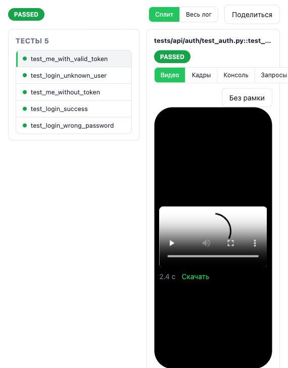

# Отчёт: миссия «Мобильный» прогон (docs/missions/2026-10-06_mobile_frame.md)

Миссия полностью смержена в `main` отдельными частями (бэкенд → фронтенд →
тесты → доводка). Эта задача — документация: README и итоговый отчёт со
скриншотом, код не менялся.

## Что сделано по пунктам миссии

1. **Флаг прогона `mobile`** — реализовано полностью. Колонка `runs.mobile
   INTEGER NOT NULL DEFAULT 0` с миграцией (`app/db.py`), поле `mobile: bool =
   False` в `RunCreate` (`app/schemas.py:94`), поле `mobile` в ответах `GET
   /api/projects/{name}/runs` и `/runs/{id}` (`app/routers/runs.py:101`).
   Раннер при `mobile=true` добавляет `MOBILE=1` в env pytest
   (`app/core/runner.py:561-564`), без флага переменную не передаёт. Пустой
   `label` подставляется как «Мобильный (Pixel 7)» (`app/core/runner.py:316`).
2. **Форма запуска** — галочка «Мобильный (Pixel 7)» под «Эфир» на
   `ui/project.html` (и на странице сборки — та же форма), подсказка про
   viewport 412×915/touch/user-agent. Включение «Мобильный» включает «Эфир»
   автоматически, снять «Эфир» вручную всё ещё можно (`ui/project.js:984-990`).
3. **Рамка телефона** — `.phone-frame` на странице прогона (`ui/project.js`,
   `maybePhoneFrame`/`applyPhoneFrameSizing`) и на share-странице
   (`ui/share.js`): портрет 412×915, статус-бар с временем кадра, масштаб по
   высоте панели через `RunLiveLogic.phoneFrameScale`, переключатель «Без
   рамки» на `localStorage`. У прогонов без `mobile` — без изменений. По пути
   уже был найден и исправлен дефект масштаба (`max-height: 480px` клампил
   инлайн-высоту рамки — поправлено на `915px`, коммит `eb225f8`, до этой
   задачи).
4. **Пилюли и бейджи** — «Pixel 7» в списке/истории прогонов, «Устройство:
   Pixel 7» в шапке карточки прогона (`ui/project.html:188`,
   `ui/project.js:1578`). Allure-отчёт не тронут.
5. **Расписания** — **сознательно не сделано**, зафиксировано в README.
   `app/routers/schedules.py` и таблица `schedules` поля `mobile` не
   получили: проверено `grep`, ни одного упоминания `mobile` в этом файле.
   Разработчик явно описал это решение в коде (`app/core/runner.py:558-559` —
   комментарий про `TH_LIVE`/контракт «Уточнение владельца»), а по факту
   пункт 5 миссии («если тянет за собой переделку формы — не делать») был
   применён: полей формы расписания было бы минимум два (галочка + подстановка
   `label`), поэтому флаг не добавляли. Прогон по расписанию всегда обычный
   desktop.
6. **Тесты** — на месте: `tests/test_runs_mobile_flag.py` (бэкенд-флаг,
   миграция, env, дефолтный label), `tests/test_run_mobile_flag.py` (реальный
   pytest-подпроцесс, `MOBILE` доходит до окружения через probe.json),
   `tests/test_mobile_frame_ui.py` (смоук разметки формы/рамки/пилюль),
   чистые функции рамки в `ui/run-live-logic.js`
   (`phoneFrameEnabled`/`phoneFrameScale`) с JS-тестом через node в
   `tests/test_run_live_logic_js.py` (`tests/js/test_run_live_logic.js`).
7. **README** — сделано этой задачей, раздел «Мобильный прогон (Pixel 7)»
   сразу после «Эфир» в блоке «Окно прогона».

## Скриншот рамки

Запущен мобильный прогон (`mobile=true`) на проекте Demo (`demo/tests/api/
auth/test_auth.py`, 5 тестов, passed) на отдельном тестовом сервере
test_hub (порт 8799, пустой `TH_TG_BOT_TOKEN`, изолированная БД этого
worktree) — Playwright запускался из venv `auto_tests_vshgu` (в venv
test_hub браузера нет, известное ограничение). Demo-проекту видео теста
подставляет готовая заглушка (`app/core/demo_video.py`, хук
`on_run_finished`) — вкладка «Видео» у неё была. Но собственного `[TH]`-плагина
у Demo нет (в `demo/` нет ни одного `[TH] start/step/end`), поэтому окно
прогона Demo по факту никогда не переходит в режим «Сплит» и вкладки с рамкой
не открываются — это уже существующее расхождение с фразой в README про
Demo («…чтобы окно работало и на чистом клоне без внешнего проекта тестов»),
см. раздел «Известные ограничения» ниже. Чтобы всё равно показать рамку на
реальном коде (а не нарисовать её руками), в БД этого изолированного прогона
вручную вставлены три строки `run_events` (`test_start`/`line`/`test_end`)
для одного nodeid — ровно тот же приём, которым сам тест `tests/
test_run_test_video.py::_insert_event` эмулирует разметку, без фальсификации
рендера: дальше страницу открывал настоящий `ui/project.js`, настоящий `GET
/api/runs/2/tests`, настоящие CSS-токены `.phone-frame`.



## Известные ограничения (не исправлялись, т.к. задача документационная)

- **Demo-проект не шлёт `[TH]`-маркеры и кадры.** В `demo/` нет ни одного
  `[TH] start/step/end` — в отличие от утверждения в README («…и в `demo/`
  этого репозитория, чтобы окно работало и на чистом клоне без внешнего
  проекта тестов»), окно прогона на Demo всегда остаётся в режиме «Весь
  лог», рамка `.phone-frame` на реальном (без ручной правки БД) мобильном
  прогоне Demo никогда не появляется — показать можно только вкладку «Видео»
  после финала прогона, и то не через окно сплита. Это предсуществующий
  пробел демо-проекта, не специфичный для этой миссии, с ней не трогался.
- **Расписания без поля `mobile`** — см. п.5 выше, зафиксировано в README.

## Прогоны проверок

`pytest -q` (полный, `.venv` этого worktree):

```
981 passed, 3 xfailed, 22 warnings in 386.78s (0:06:26)
```

Падений нет (упомянутые в правилах миссии `test_runner_timeout.py` и
`test_office_approve_on_failed_merge…` в этом прогоне не всплыли — флак не
воспроизвёлся).

Отдельно мобильные/JS-тесты рамки (`-v`):

```
tests/test_run_live_logic_js.py .                  [узлы рамки: phoneFrameEnabled/phoneFrameScale]
tests/test_mobile_frame_ui.py ............          (12 тестов)
tests/test_run_mobile_flag.py ..                    (2 теста)
tests/test_runs_mobile_flag.py ..........           (10 тестов)
======================= 25 passed, 2 warnings in 11.29s ========================
```

Все 25 тестов прошли.
